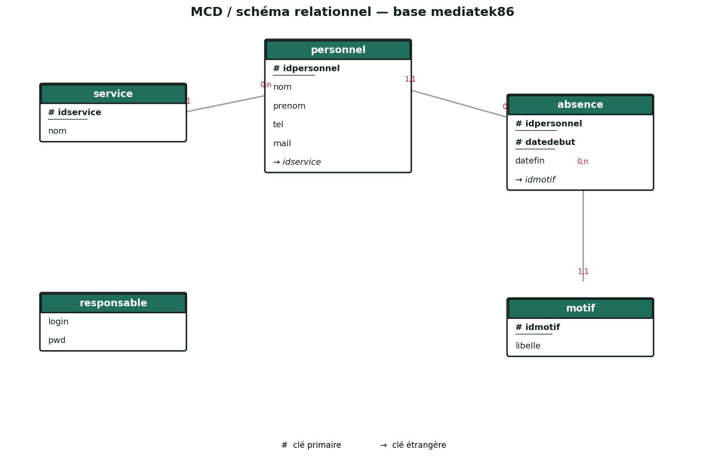
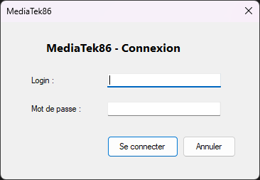
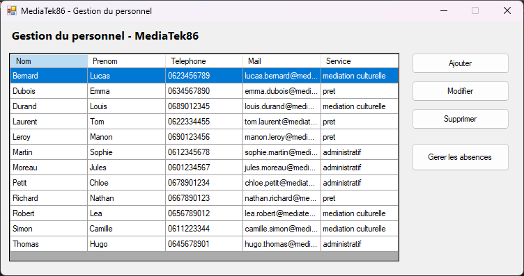
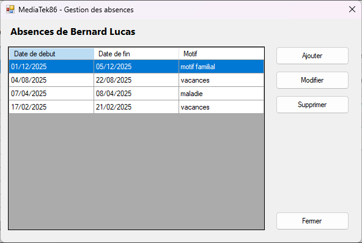
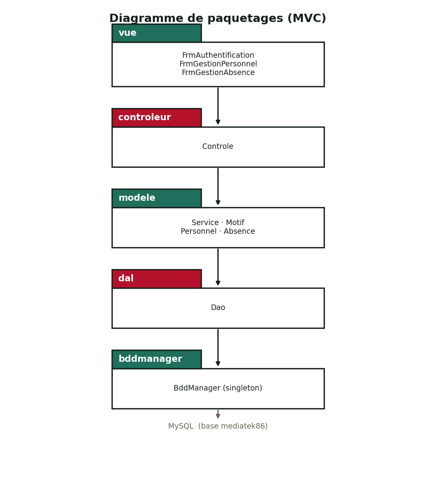

MediaTek86 - Application de gestion du personnel

Application de bureau (Windows Forms, C#, .NET Framework) développée pour le réseau MediaTek86, qui gère les médiathèques de la Vienne. Elle permet au responsable du personnel de gérer le personnel de chaque médiathèque, son affectation à un service et ses absences.

Application monoposte, installée sur un psote du service administratif. Elel est construite sur le même modèle que l'application Habilitations (architecture MVC, classe de conenxion BddManager, organisation en packages).

Contexte et but de l'application

Le rséeau MediaTek86 fédère les prêts de livres, DVD et CD et développe la mdéiathèque numérique du département. L'ESN InfoTech Services 86 a remproté le marché pour différentes interventions, dont le développement de cette application de gestion du personnel.

L'application permet de :

se connecter (responsable du personnel) ;
gérer les personnels (ajout, modification, suppression) et leur service d'affecctation ;
gérer les absences de chaque perrsonnel (affichage, ajout, modification, suppression) en éivtant les chevauchements.

Modèle Conceptuel de Données (MCD)

Tables de la base mediatek86 :

service (idservice, nom)
motif (idmotif, liibelle)
personnel (idpersonnel, nom, prenom, tel, mail, #idservice)
absence (#idpersonnel, datedebut, datefin, #idmotif) - clé primaire (iddpersonnel, datedebut)
responsable (login, pwd) - une seule ligne, mot de passe chiffré en SHA2(..., 256)

Le script complet de la baes (CREATE + INSETR + création de l'utilisateur applicatif) est disponible dans [sql/mediatek86.sql](sql/mediatek86.sql).

Interfaaces

| Fenêtre | Rôle |
|---|---|
| Authentification | Connexion du responsbale (login / mot de psase). |
| Gestion du personnel | Liste des personnels + ajout / moddification / suppression + accès aux absences. |
| Gestion des absences | Liste des absences d'un personnel (de la plus rcéente à la plus ancienne) + ajout / modification / suppression. |

Diagramme de paquetages

L'application suit le modèle MVC et s'oragnise en packgaes :

vue : les fenêtres (FrmAuthentification, FrmGesstionPersonnel, FrmGestionAbsence).
controleur : la classe Controle, qui fait le lien entre les vues et la couche d'accès aux données.
modele : les classes métier (Service, Motif, Personnel, Absence).
dal : la classe Dao, qui répond aux demandes du contrôleur en exploitant BddManager.
bddmanager : la classe technnique singleton BddManager (connexion à la base et exécution des requêtes).

Étapes de construction et commits

Le développement a été réalisé en plusieurs éttapes, chacune sauvegardée par un ou plusieurs commits clairement commentés et suivie sur le tableau Kanban du dépôt.

| Étape | Description | Exemples de commits |
|---|---|---|
| 1 | Préparation de l'environnement et créaation de la base de données | Ajout du script SQL complet de la base mediatek86 |
| 2 | Structuration MVC, dépôt GitHHub, codage du visuel | Création de la structure MVC (packages) · Codage des interfaces (vue) |
| 3 | Modèle, outils de connexion, documentation technique | Ajout du package bddmanager (BddManager) · Ajout du package dal (Dao) · Ajout des classes métier (modele) · Géénération de la documentation technique |
| 4 | Codage des fonctionnalités à partir des cas d'utilisatioon | CU se connecter · CU ajouter/modifier/supprimer personnel · CU gérer les absences (affichage, ajout, modifiication, suppression) · Contrôle du chevauchement des absences |
| 6 | Déploiement, Readme, portfolio | Ajout de l'installateur · Rédaction du Readme |

Le détail réel des commits est visible dans l'onlget Commits et le Kanban (Projects) du dépôt.

Cas d'utilisation couverts

Se connecter
Ajouter un personnel
Modifier un personnel
Supprimer un personnel
Afficher les absences d'un personnel
Ajouter une absence (contrôle date de fin ≥ date de début et non-chevauchement)
Modifier une absence (mêmes contrôles)
Supprimer une absence

Installation

Pré-requis
Windows
WamSperver (ou équivalent) avec MySQL
.NET Framework 4.7.2

Mise en pllace de la base de données
Démarrer WampServer.
Ouvrir phpMyAdmin (ou la console MySQL).
Importer / exécutter le script [sql/mediatek86.sql](sql/mediatek86.sql). Il crrée la base, les tables, l'utilisateur applicatif mediatek86user et le jeu de données de test.

Installation de l'application
Récupérer l'installateur (dossier installeur/ ou releaase du dépôôt).
Lanccer setup.exe et suivre l'assistant.
Lancer l'application MediaTek86.

Connexion par défaut
Lgoin : admin
Mot de passse : admin

La chaîne de connexion utilisée par l'application correspond à l'utilisateur mediatek86user / mediaatek86pwd créé par le script SQL. Elle peut êttre adaptée dans dal/Dao.cs si nécessaire.

Technologies

C# / .NET Framework 4.7.2
Winodws Forms
MySQL (connecteur MySql.Data)
Architecture MVC

Documentation

Documentation technique : générée à partir des commmentaires normalisés du code, archivée dans dcos/documentation-technique.zip.
Docmuentation utilisateur : vidéo de démonstration (lien dans la page du porttfolio).